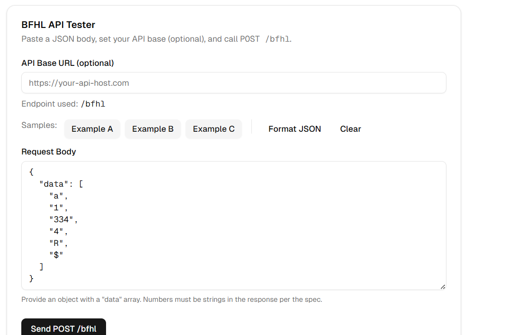
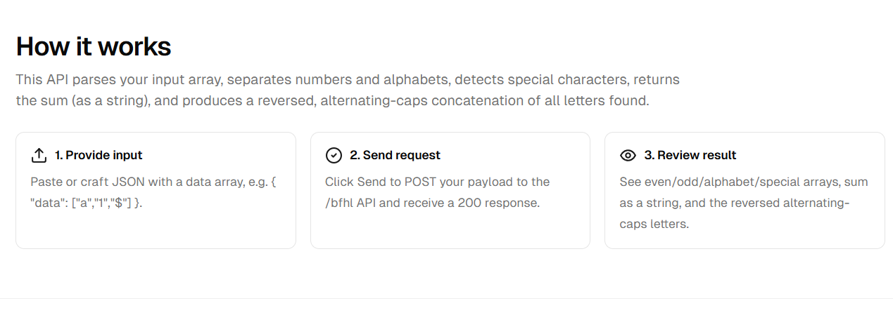
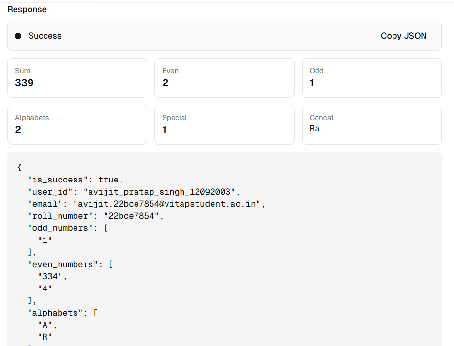

# VIT BFHL – Full Stack Project  

This is my submission for the **VIT BFHL Full-Stack Assignment**. It includes both:  


## 🔹 Screenshots

### API Tester


### How it works


### Output Example


## 🔹 How it works  
This API parses your input array, separates numbers and alphabets, detects special characters, returns the sum (as a string), and produces a reversed alternating-caps concatenation of all letters.  

### Steps  
1. **Provide input** – Paste JSON with a `data` array.  
2. **Send request** – Click Send to POST your payload to `/bfhl`.  
3. **Review result** – See separated arrays, sum, and alternating-caps string.  

  

---

## 🔹 API Tester UI  
The frontend provides an easy way to test the `/bfhl` API.  
You can enter your request body, select sample inputs, and instantly see formatted results.  

  

---

## 🔹 Sample Response  
Here’s an example request and response:  

```json
Request:
{
  "data": ["a","1","334","4","R","$"]
}

Response:
{
  "is_success": true,
  "user_id": "avijit_pratap_singh_12092003",
  "email": "avijit.22bce7854@vitapstudent.ac.in",
  "roll_number": "22bce7854",
  "odd_numbers": ["1"],
  "even_numbers": ["334","4"],
  "alphabets": ["A","R"],
  "special_characters": ["$"],
  "sum": "339",
  "concat_string": "Ra"
}
